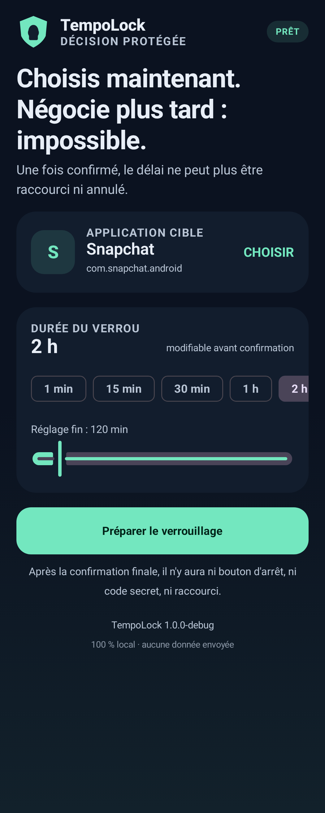
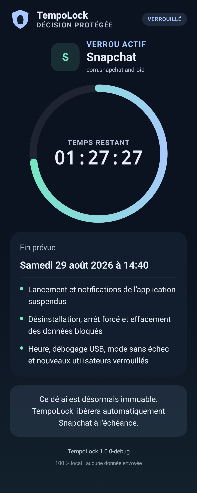

# TempoLock

TempoLock est une application Android locale qui suspend une application choisie pendant une durée fixée à l'avance. La durée est réglable **avant** la confirmation, de 1 minute à 30 jours. Une fois le verrou activé, l'interface ne propose ni bouton d'arrêt, ni code secret, ni raccourcissement du délai.

Le projet vise un appareil personnel dédié aux essais ou un émulateur. Ce n'est pas une simple surcouche visuelle : TempoLock utilise les politiques système Android et doit devenir le **Device Owner** (propriétaire de l'appareil).

> **Avertissement majeur** — La mise en place sur un téléphone déjà utilisé demande généralement une réinitialisation d'usine. Sauvegardez et vérifiez vos données avant toute tentative. Commencez sur un émulateur vierge.

## Télécharger l'APK

- [Télécharger l'APK officielle TempoLock 1.0.0](https://github.com/StephaneSGL/TempoLock/releases/latest/download/TempoLock-1.0.0-release.apk)
- [Consulter la release, les empreintes et les notices](https://github.com/StephaneSGL/TempoLock/releases/latest)

L'APK officielle exige Android 13 / API 33 ou plus récent. Vérifiez son SHA-256
et le certificat publiés dans la release avant installation. La clé privée de
signature n'est jamais incluse dans Git, dans l'APK ni dans les assets publics.

Une installation ordinaire permet d'ouvrir l'application, mais le verrou fort
anti-désinstallation exige le provisionnement **Device Owner** expliqué dans le
guide d'installation. Ne réinitialisez pas un téléphone contenant des données
non sauvegardées.

## Documentation

- [Installation, build, signature et provisionnement Device Owner](docs/INSTALLATION_FR.md)
- [Utilisation, récupération, mise à jour et retour arrière](docs/UTILISATION_FR.md)
- [Architecture technique et cycle de session](docs/ARCHITECTURE.md)
- [Modèle de sécurité, garanties et limites](docs/SECURITE.md)
- [Tests automatisés, captures et E2E sur émulateur](docs/TESTS.md)
- [Licence TempoLock](LICENSE) et [notices tierces](THIRD_PARTY_NOTICES.md)

Pour une première prise en main, suivez l'installation sur un AVD jetable, puis le scénario E2E avec l'application factice. Lisez le guide de sécurité avant tout provisionnement d'un téléphone contenant des données importantes.

## Aperçu

| Configuration du verrou | Verrou actif |
|---|---|
|  |  |

## Ce que fait l'application

- affiche les applications utilisateur lançables et permet d'en choisir une ;
- demande une durée de 1 minute à 30 jours puis une confirmation explicite avec le mot `VERROUILLER` ;
- suspend le paquet choisi avec `DevicePolicyManager.setPackagesSuspended()` ;
- bloque la désinstallation du paquet ciblé pendant la session et protège TempoLock contre sa propre désinstallation même lorsqu'aucune session n'est active ;
- désactive pendant la session le contrôle des applications, l'installation et la désinstallation, le débogage, le démarrage sans échec, la modification de l'heure, la création ou le changement d'utilisateur et la réinitialisation depuis les réglages Android ;
- conserve l'état dans deux journaux atomiques signés par HMAC, avec numéro de génération et tombstone signé à la libération pour éviter qu'un ancien état survivant ne ressuscite un verrou ;
- réconcilie le verrou au démarrage, après un redémarrage, un changement d'heure ou une mise à jour de TempoLock ;
- exige l'autorisation d'alarme exacte avant l'armement, puis programme à la fois une alarme exacte et un watchdog inexact indépendant ;
- exige `SystemClock.currentNetworkTimeClock()` au démarrage du verrou, utilise ensuite le temps monotone tant que l'appareil n'a pas redémarré et réutilise obligatoirement l'heure réseau après un redémarrage ;
- fonctionne en mode **fail-closed** : si l'heure réseau, les journaux ou une confirmation Android sont indisponibles, la cible reste verrouillée et TempoLock programme une nouvelle tentative au lieu de libérer sur une hypothèse.

Une application suspendue ne peut normalement plus démarrer d'activité, ses notifications sont masquées et elle disparaît des applications récentes. Android refuse toutefois de suspendre certains paquets critiques, notamment des composants d'administration, le lanceur actif, l'installateur, le désinstallateur, le vérificateur de paquets, le téléphone par défaut ou le contrôleur d'autorisations. Voir la [référence officielle de `DevicePolicyManager`](https://developer.android.com/reference/android/app/admin/DevicePolicyManager#setPackagesSuspended(android.content.ComponentName,%20java.lang.String[],%20boolean)).

## Ce que TempoLock ne peut pas garantir

Le terme « totalement impossible à contourner » serait faux sur un appareil dont l'utilisateur garde le contrôle physique et logiciel complet.

- Une **réinitialisation d'usine par le recovery**, un déverrouillage du bootloader, un **root**, un reflash de la ROM ou une modification du système peuvent supprimer ou neutraliser TempoLock.
- La restriction `DISALLOW_FACTORY_RESET` bloque les chemins Android ordinaires ; elle ne transforme pas le téléphone en matériel inviolable.
- TempoLock bloque un **nom de paquet précis**. Il ne bloque pas le site web du service, une application clonée ou modifiée portant un autre paquet, une autre application équivalente, un autre appareil, ni nécessairement un profil déjà existant mal configuré.
- Le projet n'est pas un contrôle réseau : il ne filtre ni domaines, ni navigateurs, ni trafic d'un autre appareil.
- Certains paquets système ne sont pas suspendables. TempoLock annule l'activation s'il ne peut pas confirmer la suspension.
- Des différences constructeur, une défaillance Android, une corruption matérielle ou une révocation anormale de politiques ne peuvent pas être exclues sans essais sur le modèle exact.
- Si l'accès aux alarmes exactes est retiré après l'activation, le watchdog inexact reste une voie de réconciliation, mais Android peut le livrer en retard. Il ne doit pas provoquer une libération anticipée.
- Une extinction ne donne pas accès à l'application ciblée. Après redémarrage, TempoLock ne peut comparer l'échéance qu'avec l'heure réseau Android. Si cette source n'est pas encore disponible, il reste fermé par précaution, même si l'heure affichée par l'utilisateur semble avoir dépassé l'échéance.
- L'absence prolongée d'heure réseau après un redémarrage peut donc prolonger le blocage au-delà de la durée choisie. Il n'existe volontairement aucun repli sur l'horloge murale modifiable par l'utilisateur.
- `SystemClock.currentNetworkTimeClock()` n'est pas une source conçue comme primitive de sécurité authentifiée. Après un redémarrage, une source réseau malveillante ou usurpée qui avancerait fortement l'heure pourrait théoriquement provoquer une libération anticipée.
- La levée de `DISALLOW_DEBUGGING_FEATURES` réautorise le débogage, mais ne réactive pas nécessairement ADB automatiquement. Il peut être nécessaire de réactiver manuellement les options développeur et le débogage USB.

Ce modèle est donc un **engagement local fort contre les manipulations Android ordinaires**, pas une garantie cryptographique contre le propriétaire d'un appareil rooté ou reflashé.

## Prérequis

- Android 13 / API 33 ou version ultérieure ;
- Java 17 et Android SDK correspondant au `compileSdk` du projet ;
- Android Platform Tools (`adb`) ;
- un émulateur vierge ou un appareil pouvant être configuré comme entièrement géré ;
- aucun compte, profil professionnel ou utilisateur secondaire au moment du provisionnement ;
- une APK **release signée** avec une clé conservée durablement ;
- l'accès spécial « Alarmes et rappels », obligatoire avant chaque armement ;
- une source d'heure réseau Android disponible au démarrage du verrou, ce qui demande normalement une connexion réseau fonctionnelle au moins le temps de synchroniser l'appareil.

La commande Device Owner de la variante release est exactement :

```powershell
adb shell dpm set-device-owner fr.tempolock.app/.receiver.TempoLockDeviceAdminReceiver
```

L'installation complète, la sauvegarde préalable, la signature et le provisionnement sont décrits dans [docs/INSTALLATION_FR.md](docs/INSTALLATION_FR.md).

## Compilation rapide sous Windows

Depuis la racine du projet :

```powershell
.\gradlew.bat :app:assembleDebug
.\gradlew.bat :app:testDebugUnitTest
.\gradlew.bat :app:lintDebug
.\gradlew.bat :app:assembleRelease
```

La configuration actuelle ne contient pas de clé release dans le dépôt. L'APK produite par `assembleRelease` doit donc être alignée et signée avant installation. Ne placez jamais la clé de signature ni ses mots de passe dans Git. Voir [l'installation release](docs/INSTALLATION_FR.md#4-construire-et-signer-lapk-release).

Les tests Compose instrumentés et les tests de captures nécessitent des commandes distinctes ; la matrice complète est dans [docs/TESTS.md](docs/TESTS.md).

## Architecture en bref

- Jetpack Compose et `MainViewModel` portent l'interface ; Hilt assemble les implémentations Android.
- `SessionCoordinator` sérialise les transitions `ARMING`, `ACTIVE` et `RELEASING` et choisit une stratégie fail-closed en cas d'incertitude.
- `DeviceOwnerPolicy` applique puis relit les politiques `DevicePolicyManager` ; aucun VPN ou service d'accessibilité ne remplace ce contrôle système.
- `SecureSessionStore` conserve deux journaux `AtomicFile` signés par HMAC, avec génération et tombstone signé.
- une alarme exacte, un watchdog inexact et les événements de démarrage déclenchent la réconciliation.

Le découpage des composants, le modèle temporel et la séquence complète sont documentés dans [docs/ARCHITECTURE.md](docs/ARCHITECTURE.md).

## Statut de validation

État final constaté le 26 août 2026 :

- **19 tests unitaires réussis**, sans échec ni erreur ;
- **7 tests instrumentés réussis** sur un AVD Android 16 / API 36 : 4 tests Compose UI et 3 tests de `SecureSessionStore` ;
- validation automatique des captures réussie et revue visuelle de la matrice responsive de **9 configurations** ;
- E2E Device Owner réussi sur un AVD API 36 jetable et réinitialisé, avec `fr.tempolock.testtarget`, une session d'une minute, la coupure d'ADB par `DISALLOW_DEBUGGING_FEATURES`, un redémarrage dur environ 25 secondes après l'armement, puis la relance et l'observation visuelle de la cible après l'échéance au moyen du contrôle gRPC de l'émulateur.

Limite de cette campagne : l'inaccessibilité visuelle de la cible **pendant** la session n'a pas été vérifiée séparément. Le résultat E2E ne doit pas être présenté comme apportant cette preuve précise. L'image Google Play employée avait déjà marqué l'assistant de configuration comme terminé ; uniquement sur cet AVD jetable, les indicateurs `device_provisioned` et `user_setup_complete` ont été remis à `0` avant `dpm set-device-owner`. Pour reproduire proprement, utilisez plutôt une image AOSP ou Google APIs sans Play.

## Distribution

La distribution officielle actuelle est une **release GitHub directe**, par APK
signée et installation manuelle/ADB. Le projet n'inclut pas le parcours
d'enrôlement Android Enterprise destiné au grand public ou aux entreprises, tel
que le provisionnement par QR code.

Une publication Google Play ne doit pas être supposée possible telle quelle : elle demanderait notamment une analyse complète des règles Play, des déclarations de permissions, du statut DPC/Android Enterprise, de la fiche de confidentialité, de la signature et du parcours de suppression. La commande ADB `dpm set-device-owner` est un outil de développement ; Android recommande d'autres méthodes d'enrôlement pour un déploiement réel. Références : [provisionnement des appareils dédiés](https://developer.android.com/work/dpc/dedicated-devices) et [alarmes exactes](https://developer.android.com/develop/background-work/services/alarms).

## Après l'échéance et mises à jour

À l'échéance vérifiée, TempoLock retire la suspension et les restrictions temporaires du paquet ciblé. **TempoLock reste néanmoins Device Owner et protégé contre sa propre désinstallation, y compris hors session.** Il n'existe pas encore d'écran de déprovisionnement.

Pour corriger ou faire évoluer l'application sans perdre ce statut, la **clé release privée d'origine est indispensable** : installez une version portant le même identifiant `fr.tempolock.app`, un `versionCode` supérieur et exactement le même certificat. Attendez la fin d'une session active avant la mise à jour. Si cette clé est perdue ou si aucune mise à jour compatible ne peut récupérer l'état, les recours ultimes sont la réinitialisation d'usine ou le reflash de l'appareil, deux opérations destructrices. Voir [docs/INSTALLATION_FR.md](docs/INSTALLATION_FR.md#récupération-après-léchéance).

La procédure opérationnelle, l'absence actuelle d'écran de déprovisionnement et la différence entre déclassement d'APK et version corrective sont détaillées dans [docs/UTILISATION_FR.md](docs/UTILISATION_FR.md#déprovisionnement-désinstallation-et-retour-arrière). Pour évaluer les hypothèses et les contournements hors périmètre, consultez [docs/SECURITE.md](docs/SECURITE.md).

## Licence

Le code source est public pour audit mais reste sous droits réservés. Les APK
officielles non modifiées peuvent être téléchargées et installées pour un usage
personnel non commercial selon [LICENSE](LICENSE). Les bibliothèques tierces
restent soumises à leurs propres licences, détaillées dans
[THIRD_PARTY_NOTICES.md](THIRD_PARTY_NOTICES.md).
